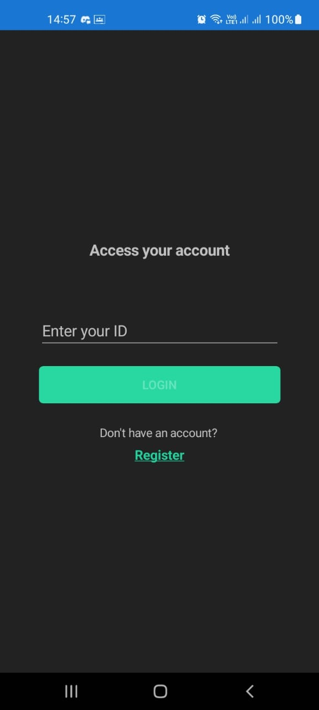
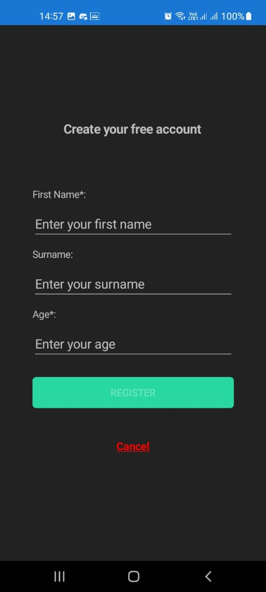
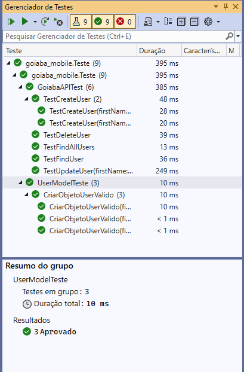

# Goiaba Mobile

  

  
  

> Foi desenvolvido uma aplicação mobile que permite o cliente se cadastrar no sistema. 

> Iniciando pela tela de login, onde o usuário pode logar com o id que foi gerado pelo sistema ao se cadastrar. Caso o usuário não esteja cadastrado no sistema, há a opção de se cadastrar. Na tela de cadastro é solicitado o FirstName, Surname e Age. O campo FirstName e Age são obrigatórios. É possível cancelar o registro clicando no botão Cancel e retornando para a tela de login. 

> Após o cadastro ser finalizado ou ser efetuado o login, o usuário acessa a página inicial da aplicação, que apresenta a mensagem escrita “Welcome `<FirstName>  <Surname>`”. Na tela principal há um menu lateral com as opções de navegação (Home e Profile), um cabeçalho com o nome do App e no menu superior além do nome da página atual tem o botão de logout. 

> Na página Profile o usuário tem a possibilidade de atualizar os dados que foram cadastrados. Na tela de atualização dos dados, os campos FirstName e Age são obrigatórios, o campo age só aceita valores entre 1 a 150, o campo Surname não é obrigatório, e também o usuário tem a possibilidade de excluir a conta.  

> Com isso, o usuário ganha a possibilidade de acessar o sistema, ter uma sessão própria e por ser uma aplicação em dispositivo móvel, ele tem fácil acesso ao sistema. 

 
 

    Cadastrar um novo usuário:

 

  
 
 
  

 

   Buscar usuário por ID:

 

  
 
 

 

   Atualizar usuário:

 

  
 
 
 

 

   Deletar usuário:

 

  
 
 
 

## Primeiros Passos ##

Para ambos os métodos abaixo, você terá que adicionar este [NuGet feed](https://pkgs.dev.azure.com/dnceng/public/_packaging/dotnet-eng/nuget/v3/index.json) para que a compilação seja bem-sucedida. Consulte [esta página de documentação](https://docs.microsoft.com/azure/devops/artifacts/nuget/consume?view=azure-devops&tabs=windows#set-up-visual-studio) para saber como.

### Windows ###
##### Instale o Visual Studio 2019+ #####

O VS 2019+ é necessário para desenvolver Xamarin.Forms. Caso ainda não o tenha instalado, você pode baixá-lo [aqui](https://www.visualstudio.com/downloads/download-visual-studio-vs). VS 2019+ Community  é totalmente gratuita. Se você estiver instalando o VS 2019+ pela primeira vez, selecione o tipo de instalação "Personalizada" e selecione o seguinte na lista de recursos para instalar:

- .NET desktop development 
  - `Individual Components > .NET > .NET Framework 4.6.1 SDK, .NET Framework 4.6.1 targeting pack, .NET Framework 4.7.2 SDK, .NET Framework 4.7.2 targeting pack`.
- Universal Windows Platform Development  
  - `Individual Components > SDKs, libraries, and frameworks > Windows 10 SDK (10.0.19041.0), Windows 10 SDK (10.0.18362.0), Windows 10 SDK (10.0.16299.0)`.
  - Download and install 14393 from https://go.microsoft.com/fwlink/p/?LinkId=838916
- Mobile Development with .NET 
  - `Individual Components > Development Activities > Xamarin Remoted Simulator`
  - If you're not using Hyper-V `Individual Components > Emulators > Hyper-V Intel Hardware Accelerated Execution Manager (HAXM)`
- Most current SDK version of .NET Core
  - Or install the most current .NET Core SDK from here https://dotnet.microsoft.com/download

O SDK da API 29 do Android 10.0 e o SDK da API 28 do Android 9.0 são necessários para desenvolver Xamarin.Forms. Eles podem ser instalados usando o [Xamarin Android SDK Manager](https://docs.microsoft.com/xamarin/android/get-started/installation/android-sdk).

Também recomendamos instalar o [Xamarin Android Device Manager](https://developer.xamarin.com/guides/android/getting_started/installation/android-emulator/xamarin-device-manager/). Isso usará as ferramentas HAXM instaladas acima e permitirá que você configure dispositivos virtuais Android (AVDs) que emulam dispositivos Android. Se você já tiver o VS 2019+ instalado, poderá verificar se esses recursos estão instalados modificando a instalação do VS 2019+ por meio do Instalador do Visual Studio.

## Testes automatizados implementados ##

Foram feitos testes testando a entidade UserModel, o teste serve para validar a criação de um novo objeto, nesse em questão são criadas 3 objetos do tipo Usermodel e validado se o objeto recebeu os dados corretamente.

Um segundo teste foi testar o CRUD da aplicação, fazendo o teste das rotas da API, Find para buscar um registro por ID, FindAll para buscar todos registros do banco, Create para criar um novo registro no bano de dados, Update para atualizar os dados de um registro existente e o Destroy para remover um registro existente no banco de dados.

## Roteiro de teste regressivo ##

- Acessar o aplicativo Mobile
- Clicar no link Register
- Clicar no link Cancel
- Clicar no link Register novamente
- Preencher todos os campos
- Clicar no botão Register
- Clicar em No
- Clicar novamente no botão Register
- Clicar em Yes e acessar a tela Home
- Acessar menu lateral
- Acessar a tela de Profile, clicando no botão Profile
- Editar todos os campos do usuário
- Clicar em Update
- Clicar em No
- Clicar em Update novamente
- Clicar em Yes e acessar a tela Home
- Acessar menu lateral
- Acessar a tela de Profile, clicando no botão Profile
- Acessar menu lateral
- Acessar a tela de Home, clicando no botão Home
- Efetuar o logout, clicando no botão Logout
- Preencher o campo login com o ID
- Clicar em Login e acessar a tela Home
- Clicar no menu lateral
- Acessar a tela de Profile, clicando no botão Profile
- Preencher apenas os campos obrigatórios
- Clicar em Update
- Clicar em No
- Clicar em Update novamente
- Clicar em Yes e acessar a tela Home
- Acessar menu lateral
- Acessar a tela de Profile, clicando no - botão Profile
- Acessar a tela de Home, clicando no botão Home
- Acessar a tela de Profile, clicando no - botão Profile
- Clicar em Delete Account 
- Clicar em No
- Clicar novamente em Delete Account
- Clicar em Yes
- Efetuar o login com o id do perfil excluído
- Clicar no link Register
- Preencher apenas os campos obrigatórios
- Clicar no botão Register e acessar a tela Home

## Vídeo de apresentação ##

Link do  YouTube : [Clique Aqui](https://youtu.be/cuUur7QkEdY)

[⬆ Voltar ao topo](#goiaba_mobile) 

